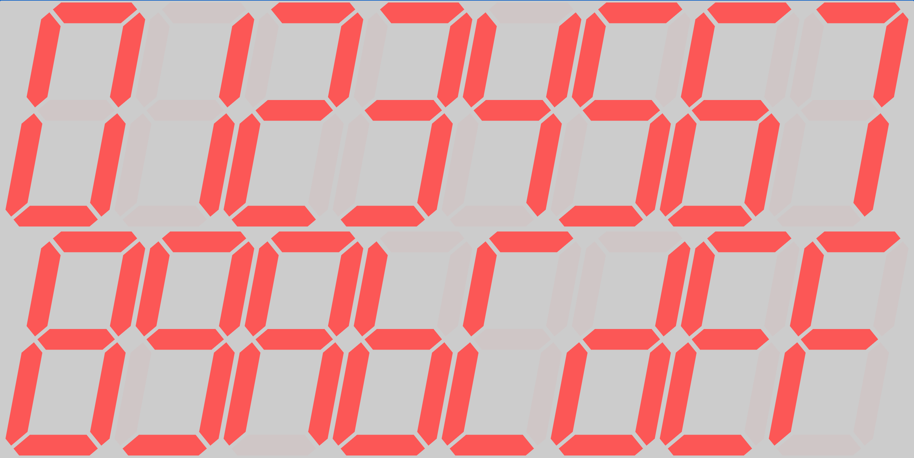

# segmented display



[](https://javadoc.io/doc/com.fsryan.ui/segmented-display)

Segmented displays are ubiquitous in the world of electronics. They are used in everything from digital clocks to thermostats to calculators to microwave ovens. This library provides a Composable function that can be used to create and style a segmented display in your Compose Multiplatform application.

## Supported Platforms

Because this library is a [Compose Multiplatform](https://www.jetbrains.com/lp/compose-multiplatform/) library, the following platforms are supported:
* Android
* iOS
* Desktop (via JVM)
* Web (via WASM)

## Project Structure

There are two modules in this project:
* [segmented-display](segmented-display/README.md), the library module that you can depend upon in your Compose Multiplatform project
* [composeApp](composeApp/README.md), a demo application that shows the main library features

## Adding this Library to your Project

If using the kotlin multiplatform plugin, first, configure the compose plugin. Then add:
```kotlin
kotlin {
    sourceSets {
        commonMain.dependencies {
            implementation("com.fsryan.ui:segmented-display:x.y.z")
        }
    }
}
```

Otherwise, configure Compose in your project. Then add the following to the dependencies block:

```kotlin
dependencies {
    implementation("com.fsryan.ui:segmented-display:x.y.z")
}
```