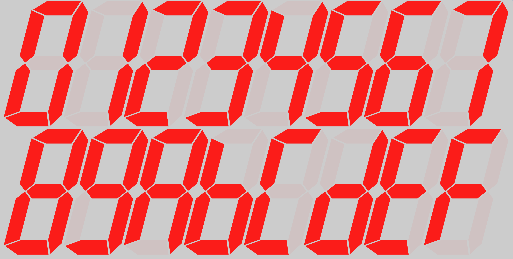
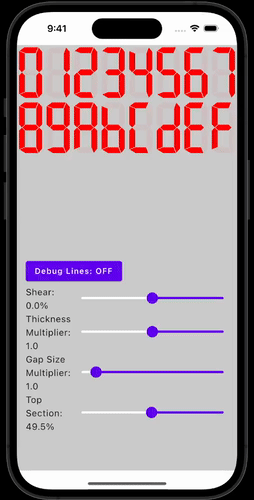

# fs-segmented-display

Inspired by [this video](https://www.youtube.com/watch?v=RTB5XhjbgZA) by [Posy](https://www.youtube.com/@PosyMusic), fs-segmented-display is a [Compose Multiplatform](https://www.jetbrains.com/lp/compose-multiplatform/) library targeting Android, desktop, iOS, and web that serves to emulate a traditional segmented display. The creator of the linked video was kind enough to provide a sheet of the segmented displays he provided, and that was where I started.

The project is broken up into two parts:
* [segmented-display](segmented-display/README.md), the actual library code
* [app](app/README.md), the application that enables you to play with some of the configurable properties of a segmented display

Eventually, this will be available as a library on Maven Central.

## A Tantalizing Gif
The below is a quick example of some of how you can style the segmented display today. 

